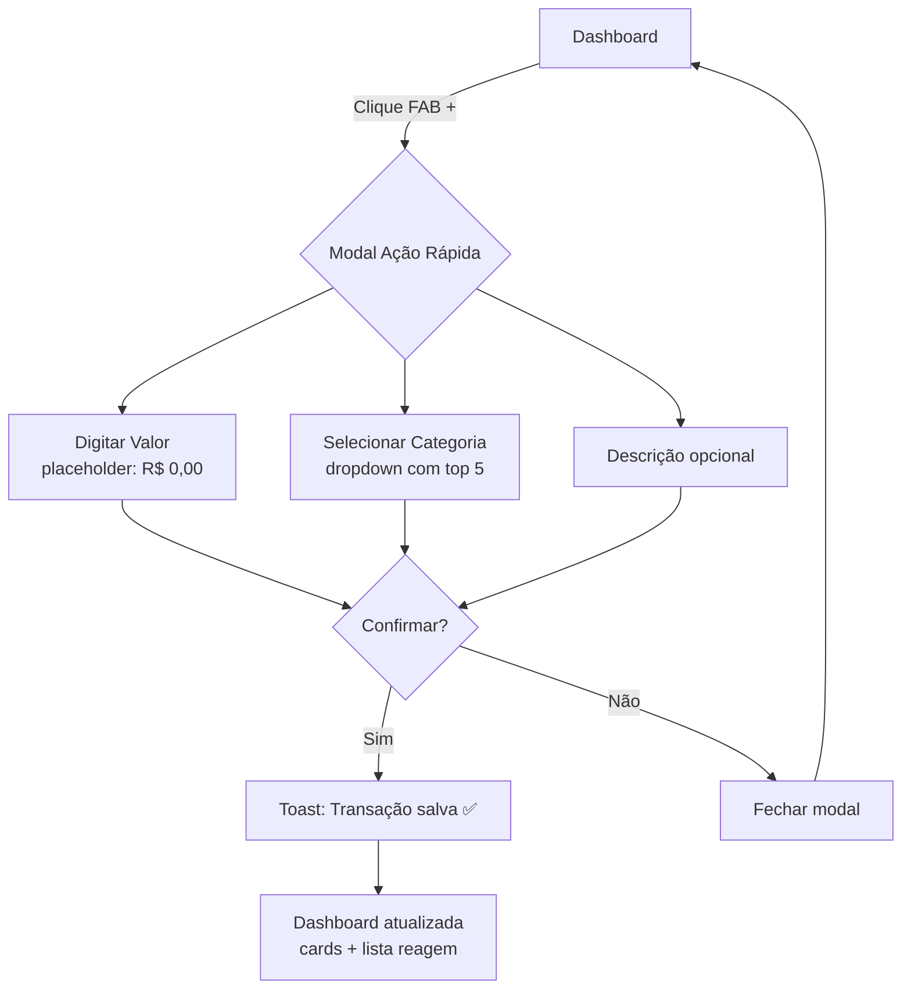
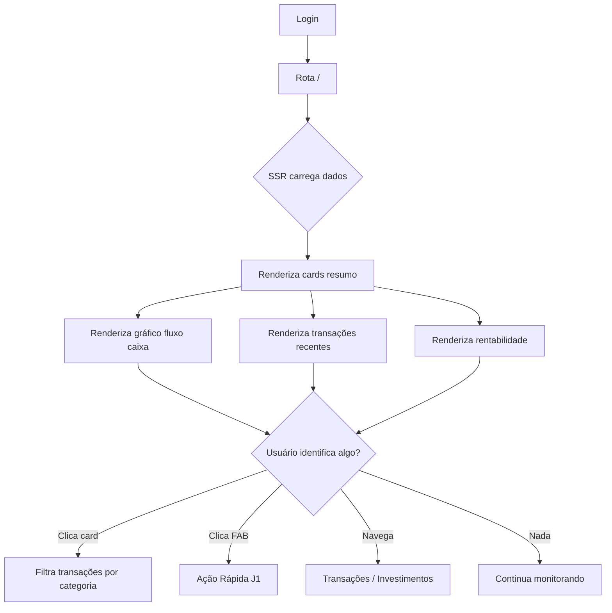
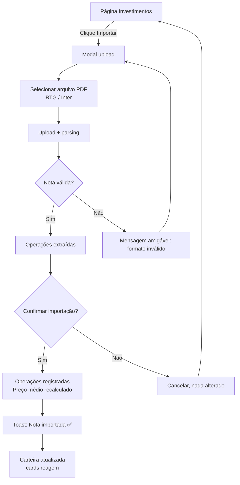
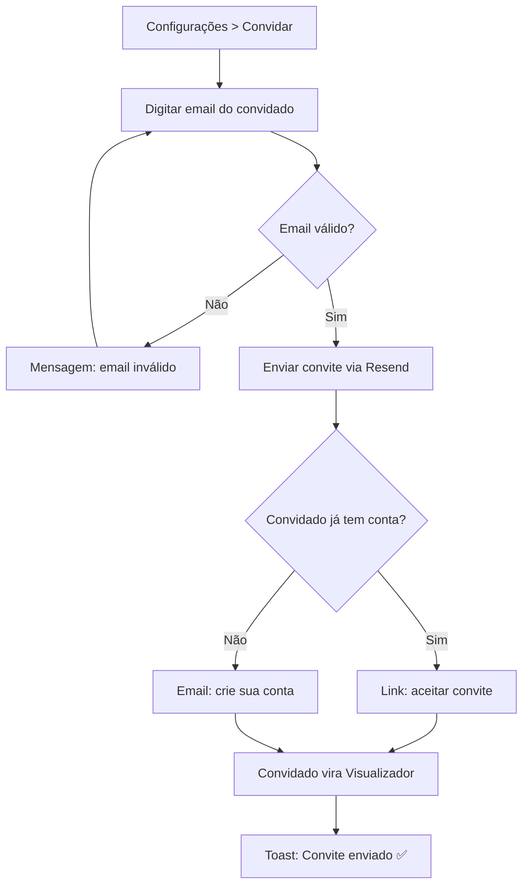

# UX Design Specification FinTrack

**Author:** Jonathan
**Date:** 2026-05-25

---

## Executive Summary

### Project Vision

Sistema de controle financeiro e investimentos com dashboards visuais, entrada de dados manual e por importação de PDF (notas de corretagem). Consolidar gastos do dia a dia, cartão de crédito e investimentos em um só lugar.

### Target Users

- **Titular** — Indivíduo que gerencia próprias finanças e investimentos. Acesso CRUD completo.
- **Visualizador** — Acompanha finanças de um Titular sem permissão de edição (cônjuge, familiar, consultor).

### Key Design Challenges

1. **Dashboard informativa sem poluição** — Gráficos e cards precisam comunicar saúde financeira rapidamente
2. **Parcelamento em cartão de crédito** — Fluxo de cadastro de transação com parcelas pode ser confuso
3. **Feedback na importação de PDF** — Usuário precisa ver claramente o que foi importado e como afetou o preço médio
4. **Dois papéis de usuário** — Navegação e permissões precisam ser óbvias para Titular e Visualizador

### Design Opportunities

- Curva de rentabilidade (custo vs mercado) para investimentos
- Ação rápida para registrar gastos sem sair da dashboard
- Feedback visual imediato pós-importação de nota de corretagem

## Core User Experience

### Defining Experience

Três pilares de igual importância:
1. **Registrar gastos do dia a dia** — transações, categorias, cartão de crédito
2. **Acompanhar a dashboard** — visão geral da saúde financeira
3. **Checar investimentos** — carteira, preço médio, rentabilidade

### Platform Strategy

- **Web SSR** (TanStack Start) — plataforma principal
- **Mobile responsivo** — mesma base de código, layout adaptável
- Sem app nativo no MVP; PWA pode ser avaliado futuramente

### Effortless Interactions

- **Ação rápida de despesa** — acesso direto da dashboard para registrar gasto sem navegação
- **Gastos do mês corrente** — página de transações já abre filtrada pelo mês atual
- **Importação de nota** — feedback imediato na carteira (o que mudou no preço médio)

### Critical Success Moments

- Reflexo imediato de um gasto na dashboard ao registrar
- Carteira de investimentos atualizada após importar nota de corretagem
- Primeiro acesso: usuário vê dados consolidados e entende sua situação financeira

### Experience Principles

1. **Zero atrito para registrar** — qualquer tela, um clique para lançar gasto
2. **Contexto sempre atual** — dashboard reflete o agora; gastos abrem no mês vigente
3. **Mobile-first mindset** — responsivo desde o início
4. **Visão consolidada** — um só lugar para finanças + investimentos

## Desired Emotional Response

### Primary Emotional Goals

- **Emoção primária:** Tranquilidade — saber exatamente para onde o dinheiro está indo
- **Momento "uau":** "Eu sei agora quanto estou gastando, para onde está indo e o que estou conseguindo investir"
- **Sentimento ao recomendar:** Clareza e confiança nas decisões financeiras

### Emotional Journey Mapping

| Estágio | Emoção desejada | Como alcançar |
|---|---|---|
| Primeiro acesso | "Finalmente entendi" | Dashboard clara com dados corretos desde o início |
| Uso diário | Fluidez | Ação rápida, poucos cliques, sem formulários longos |
| Erro | Acolhimento | Mensagens amigáveis, sem jargão técnico |
| Retorno | Familiaridade | Dados sempre atualizados, layout consistente |

### Emotions to Avoid

- **Burocracia** — nada de formulários longos ou fluxos com muitos passos
- **Lentidão** — SSR + cache, navegação instantânea, sem carregamentos desnecessários

### Design Implications

- Tranquilidade → dashboard informativa, saldos corretos, feedback imediato
- Evitar burocracia → ação rápida na dashboard, filtro por mês corrente como default
- Evitar lentidão → TanStack Query cache, SSR, respostas rápidas
- Mensagens amigáveis → tom próximo, português claro, sem stack trace

## UX Pattern Analysis & Inspiration

### Inspiring Products Analysis

**Nubank:**
- Simplicidade radical e design limpo
- Tom de voz próximo ("seu dinheiro", português claro)
- Feedback visual instantâneo
- Cards de resumo no topo com saldo e limites
- Navegação por abas inferior

**Organizze:**
- Gestão financeira com categorização completa
- Dashboard com gráficos de fluxo de caixa e categorias
- Botão de ação rápida para novo registro
- Visão de orçamentos com progresso

### Transferable UX Patterns

| Padrão | Origem | Aplicação no FinTrack |
|---|---|---|
| Ação flutuante (FAB) para novo registro | Organizze | Botão "+" fixo na dashboard para ação rápida de despesa |
| Cards de resumo no topo | Nubank | Saldo, receitas, despesas, total investido em FR-1 |
| Tom de voz próximo | Nubank | Mensagens em português claro, sem jargão técnico |
| Gráficos simples | Organizze | Área (fluxo de caixa) + pizza (categorias) |
| Navegação por abas/sidebar | Nubank | Sidebar já implementada no Layout.tsx |

### Anti-Patterns to Avoid

- Tabela de extrato densa sem filtros — transações devem ter filtros por tipo, período, categoria
- Muitos cliques para lançar despesa — ação rápida direto na dashboard
- Linguagem técnica ("erro 500", "fetch failed") — sempre mensagens amigáveis

## Design System Foundation

### 1.1 Design System Choice

**shadcn/ui** (já estabelecido no projeto) — themeable system baseado em Radix + Tailwind CSS.

### Rationale for Selection

- Já integrado e em uso no projeto
- Componentes acessíveis (Radix primitives)
- Customização total via Tailwind + CSS variables
- Componentes financeiros novos seguem shadcn/ui patterns

### Customization Strategy

- **Cor primária:** Azul
- Paleta definida via `tailwind.config.cjs` + variáveis CSS
- Tipografia: Tailwind defaults (aprimorar conforme necessidade)
- Novos componentes (gráficos Recharts, tabelas TanStack Table) seguem patterns visuais do shadcn/ui

## 2. Core User Experience

### 2.1 Defining Experience

**"Abrir o sistema e ver, em segundos, como estão suas finanças e investimentos"** — a dashboard como centro nervoso do FinTrack.

### 2.2 User Mental Model

- Hoje o usuário usa planilhas, Nubank, Organizze — dados espalhados em múltiplos lugares
- Expectativa: abrir o sistema e ter TUDO consolidado, sem precisar navegar entre telas
- Frustração atual: não ter visão unificada de gastos + investimentos

### 2.3 Success Criteria

- Dashboard carrega em < 1s (SSR + TanStack Query cache)
- Cards de resumo respondem: saldo, receitas, despesas, total investido
- Gráfico de rentabilidade responde: estou ganhando ou perdendo dinheiro?
- Ação rápida disponível sem sair da tela

### 2.5 Experience Mechanics

1. **Iniciação:** Usuário faz login → rota `/` (dashboard)
2. **Interação:** Olha cards → vê gráficos → identifica algo → clica para detalhar ou registrar
3. **Feedback:** Dados refletem o estado atual em tempo real (TanStack Query refetch)
4. **Completude:** Usuário sai sabendo exatamente como estão suas finanças

## Visual Design Foundation

### Color System

- **Cor primária:** Azul claro vibrante e calmo
- Paleta definida via variáveis CSS do shadcn/ui + `tailwind.config.cjs`
- Cores semânticas: success (verde), warning (amarelo), error (vermelho), seguindo padrão shadcn/ui
- Contraste acessível em todos os temas

### Typography System

- **Fonte principal:** Roboto (Google Fonts)
- Escala tipográfica seguindo padrão Tailwind (text-sm, text-base, text-lg, text-xl, text-2xl...)
- Roboto para headings e body text

### Spacing & Layout Foundation

- **Layout arejado** — espaçamento generoso entre seções e cards
- Base de espaçamento: 4px (padrão shadcn/ui + Tailwind)
- Padding de página: `p-8` (32px) em desktop, `p-4` (16px) em mobile
- Gap entre cards: `gap-6` (24px)
- Grid responsivo: `grid-cols-1 md:grid-cols-2 lg:grid-cols-3` para cards

### Accessibility Considerations

- Contraste mínimo WCAG AA em todos os componentes
- Fonte Roboto em tamanhos legíveis (min 14px para body)
- Estados de foco visíveis em todos os elementos interativos
- Suporte a preferência de redução de movimento

## Design Direction Decision

### Design Directions Explored

HTML visualizer gerado em `_bmad-output/planning-artifacts/ux-design-directions.html` com amostras de:
- Sistema de cores (azul claro vibrante, paleta 50-900)
- Tipografia Roboto em escala (Display, H1, H2, Body)
- Cards de resumo com valores financeiros
- Botões (primary, outline, ghost, success, danger)
- Formulários com foco azul
- Mensagens em tom amigável (info, success, warning, error)
- Dashboard mockup completo com navegação, gráfico de fluxo de caixa e transações recentes
- Referência de espaçamento arejado (base 4px)

### Chosen Direction

Direção única definida: **"Azul Claro Vibrante + Roboto + Layout Arejado"** — inspirado na simplicidade do Nubank com a completude do Organizze.

### Design Rationale

- Azul claro transmite **tranquilidade e confiança** (emoção primária)
- Roboto é moderna, legível e familiar ao público brasileiro
- Layout arejado evita a **burocracia e poluição visual** que queremos evitar
- Cards e botões com bordas arredondadas (12-16px) passam acolhimento
- Mensagens amigáveis em português claro sem jargão técnico

## User Journey Flows

### J1 — Registrar Gasto Rápido

**Entry point:** Dashboard → FAB "+" (canto inferior direito)
**Persona:** Titular
**Objetivo:** Registrar despesa em ≤ 3 taps, sem sair da tela atual



**Mecânica:**
- Modal leve (dialog shadcn/ui)
- Categorias mais usadas no topo do dropdown
- Se cartão de crédito selecionado, campo de parcelas aparece
- Após salvar: toast verde + cards e transações recentes atualizam via TanStack Query refetch
- **Anti-pattern evitado:** formulário cheio numa página separada

### J2 — Acompanhar Dashboard

**Entry point:** Login → rota `/`
**Persona:** Titular ou Visualizador
**Objetivo:** Entender situação financeira em segundos



**Mecânica:**
- SSR carrega página com dados (TanStack Start server functions)
- TanStack Query mantém dados frescos (refetch em background)
- Visualizador: mesma tela, sem botões de ação (CRUD desabilitado)
- Cards clicáveis levam à lista filtrada

### J3 — Importar Nota de Corretagem

**Entry point:** Investimentos → Botão Importar
**Persona:** Titular
**Objetivo:** Importar PDF e ver impacto na carteira



**Mecânica:**
- PDF enviado via server function → `parser-de-notas-de-corretagem`
- Preview das operações extraídas antes de confirmar
- Mensagens amigáveis em caso de erro ("Não reconhecemos esse formato. Notas da BTG e Inter são suportadas.")
- Após confirmar: preço médio recalculado, carteira reflete mudanças

### J4 — Convidar Visualizador

**Entry point:** Configurações (ou menu do usuário) → Convidar
**Persona:** Titular
**Objetivo:** Dar acesso read-only a outra pessoa



**Mecânica:**
- Titular digita email → Resend envia email transacional
- Se email já tem conta: link direto para aceitar convite
- Se não: link para cadastro (email + senha)
- Após aceitar: Visualizador vê dashboards do Titular, sem botões de ação

### Journey Patterns

- **Todas as jornadas usam modal/dialog** para ações — sem mudança de página
- **Feedback imediato via toast** — posicionado top-right
- **Dados reativos** — TanStack Query refetch após qualquer mutação
- **Modo leitura** para Visualizador — mesma interface, ações ocultas

### Flow Optimization Principles

1. **Mínimo de taps para valor** — ação rápida em 3 taps
2. **Preview antes de confirmar** — importação de nota mostra operações extraídas antes de salvar
3. **Recuperação de erro amigável** — sem jargão técnico
4. **Contexto preservado** — modais não perdem o estado da página atual

## Component Strategy

### Design System Components

**shadcn/ui** fornece a base de componentes:

| Componente | Uso |
|---|---|
| `Button` | Botões de ação (primary, outline, ghost, success, danger) |
| `Card` | Container base para SummaryCard e AssetCard |
| `Dialog` | QuickActionModal, BrokerNoteUpload, InviteForm |
| `DropdownMenu` | Menu de ações por transação/ativo |
| `Input` | Campos de formulário |
| `Select` | Seleção de categoria, período |
| `Sonner` | Toasts de feedback |
| `Tabs` | Navegação entre abas (ex: visão geral vs histórico) |
| `Badge` | Status de transação, rentabilidade |
| `Skeleton` | Loading state dos cards |
| `Separator` | Divisão entre seções |
| `Sheet` | Painel lateral para detalhes |
| `Avatar` | Avatar do usuário |
| `Table` | Lista de transações/investimentos |

### Custom Components

#### SummaryCard

**Propósito:** Exibir métrica financeira (saldo, receitas, despesas, patrimônio) em formato claro e escaneável.

| Propriedade | Descrição |
|---|---|
| **Anatomy** | Ícone + Label + Valor + Variação (%) |
| **Variants** | `default` (fundo branco), `highlight` (fundo azul claro) |
| **States** | `normal`, `loading` (skeleton), `empty` (R$ 0,00) |
| **Content** | Valor formatado BRL, variação positiva/negativa com cor |
| **Acessibilidade** | `role="region"`, `aria-label` com label + valor |

#### TransactionCard

**Propósito:** Representar uma transação financeira individual na lista.

| Propriedade | Descrição |
|---|---|
| **Anatomy** | CategoryIcon + Descrição + Valor (cor por tipo) + Data + Badge de categoria |
| **States** | `normal`, `loading` (skeleton) |
| **Actions** | Clique → detalhes da transação |
| **Acessibilidade** | `role="listitem"`, valor com sinal |

#### QuickActionModal

**Propósito:** Registrar gasto rápido em ≤ 3 interações.

| Propriedade | Descrição |
|---|---|
| **Anatomy** | Dialog com input de valor + Select de categoria + input descrição + botão confirmar |
| **Trigger** | FAB + na dashboard |
| **Estados** | `idle`, `submitting`, `success` (toast), `error` |
| **Acessibilidade** | Auto-foco no input de valor, `aria-describedby` para ajuda |

#### FAB (Floating Action Button)

**Propósito:** Botão de ação primária flutuante (criar transação).

| Propriedade | Descrição |
|---|---|
| **Anatomy** | Botão circular com ícone de "+", posicionado canto inferior direito |
| **Variants** | Um único tamanho (56px), shadow elevado |
| **States** | `default`, `active` (gira 45° ao abrir modal) |
| **Acessibilidade** | `aria-label="Nova transação"` |

#### BrokerNoteUpload

**Propósito:** Upload e preview de nota de corretagem PDF.

| Propriedade | Descrição |
|---|---|
| **Anatomy** | Dialog com área de drop/file picker + preview das operações extraídas + confirmar/cancelar |
| **States** | `empty`, `uploading`, `parsing`, `preview`, `error` |
| **Mensagens erro** | "Formato não suportado. Aceitamos PDFs da BTG Pactual e Inter." |

#### CategoryIcon

**Propósito:** Mapear categoria financeira → ícone + cor.

| Propriedade | Descrição |
|---|---|
| **Anatomy** | Ícone (Lucide) + cor de fundo circular |
| **Tamanhos** | `sm` (24px), `md` (32px), `lg` (40px) |
| **Acessibilidade** | `aria-hidden="true"` com label textual ao lado |

#### CashFlowChart

**Propósito:** Gráfico de fluxo de caixa mensal (receitas vs despesas).

| Propriedade | Descrição |
|---|---|
| **Anatomy** | Recharts BarChart com duas séries (receita/despesa) |
| **Variants** | `monthly`, `yearly` |
| **States** | `loading` (skeleton), `empty` (placeholder "Adicione transações para ver o gráfico"), `data` |
| **Paleta** | Receita = `success`, Despesa = `danger` |

#### AssetCard

**Propósito:** Exibir ativo na carteira (ação, FII, etc).

| Propriedade | Descrição |
|---|---|
| **Anatomy** | Código + nome + quantidade + preço médio + cotação atual + rentabilidade |
| **States** | `normal`, `loading` (skeleton), `error` (cotação indisponível) |
| **Actions** | Clique → detalhes do ativo |

#### InviteForm

**Propósito:** Convidar visualizador por email.

| Propriedade | Descrição |
|---|---|
| **Anatomy** | Dialog com input de email + botão enviar |
| **States** | `idle`, `sending`, `sent`, `error` |
| **Validação** | Email válido + email diferente do próprio |

### Component Implementation Strategy

- Todos os custom components usam **shadcn/ui + Tailwind** como base
- Componentes compostos extendem primitivos do shadcn (ex: `Dialog` → `QuickActionModal`)
- Componentes visuais puros (`SummaryCard`, `TransactionCard`) como componentes simples com props
- Gráficos via Recharts utilizando tokens de cor do design system
- Ícones via `lucide-react`
- Loading states: shadcn `Skeleton` com animação padrão

### Implementation Roadmap

| Fase | Componentes | Jornada |
|---|---|---|
| **Fase 1 — Core** | SummaryCard, TransactionCard, FAB, QuickActionModal, CategoryIcon | J1, J2 |
| **Fase 2 — Investimentos** | BrokerNoteUpload, AssetCard, CashFlowChart | J3 |
| **Fase 3 — Colaboração** | InviteForm | J4 |

## UX Consistency Patterns

### Button Hierarchy

| Tipo | Uso | Cor | Exemplo |
|---|---|---|---|
| **Primary** | Ação principal (salvar, confirmar, enviar) | Azul claro (`primary-500`) | "Salvar transação" |
| **Secondary** | Ação alternativa (cancelar, voltar) | Outline (borda + texto) | "Cancelar" |
| **Ghost** | Ação não destrutiva (editar, filtrar, ver mais) | Texto sem fundo | "Ver detalhes" |
| **Danger** | Excluir, remover | Vermelho (`danger`) | "Excluir transação" |
| **FAB** | Criar transação | Azul claro, circular, 56px | "+" canto inferior direito |
| **Icon button** | Ação em linha (editar, excluir item) | Ghost, só ícone | Lápis, X |

**Regras:**
- Máximo 1 primary por card/modal
- Danger sempre com confirmação (alert dialog)
- FAB presente apenas na dashboard para usuário Titular (oculto para Visualizador)

### Feedback Patterns

| Tipo | Componente | Posição | Duração | Cor |
|---|---|---|---|---|
| **Success** | Sonner toast | Top-right | 4s | Verde |
| **Error** | Sonner toast | Top-right | 6s | Vermelho |
| **Info** | Sonner toast | Top-right | 4s | Azul |
| **Loading** | Skeleton + spinner | Inline no card | Até carregar | Cinza |
| **Empty state** | Ilustração + texto | Centralizado no container | Permanente | Cinza claro |
| **Confirmação** | AlertDialog | Centralizado | Até ação | — |

**Mensagens amigáveis:**
- Erro: "Algo deu errado. Tente novamente." (sem jargão técnico)
- Empty: "Nenhuma transação ainda. Clique em + para começar."
- Loading: Esqueletos pulsantes (shadcn Skeleton)

### Form Patterns

| Padrão | Comportamento |
|---|---|
| **Valor monetário** | Input com máscara R$ 1.234,56 (atualiza enquanto digita) |
| **Validação inline** | Erro exibido abaixo do campo no blur e no submit |
| **Submit** | Botão primary desabilitado até campos obrigatórios preenchidos |
| **Campos obrigatórios** | Marcados com asterisco vermelho (*) |
| **Auto-foco** | Primeiro campo recebe foco ao abrir modal |
| **Categorias** | Select com top 5 usadas no topo, ordenadas por frequência |

### Navigation Patterns

| Contexto | Padrão |
|---|---|
| **Desktop** | Sidebar esquerda (240px) com ícone + label + indicador ativo |
| **Mobile** | Bottom tab bar com 5 itens (Dashboard, Transações, Investimentos, Relatórios, Config) |
| **Sub-navegação** | Tabs (shadcn/ui Tabs) dentro da página (ex: Histórico vs Gráfico) |

**Itens de navegação:**
1. Dashboard (ícone: LayoutDashboard)
2. Transações (ícone: ArrowRightLeft)
3. Investimentos (ícone: TrendingUp)
4. Relatórios (ícone: BarChart3)
5. Configurações (ícone: Settings)

### Modal and Overlay Patterns

| Tipo | Uso |
|---|---|
| **Dialog** | Ação rápida (QuickActionModal, BrokerNoteUpload, InviteForm) |
| **AlertDialog** | Confirmação destrutiva (excluir) |
| **Sheet** | Detalhes de transação/ativo (painel lateral) |
| **DropdownMenu** | Ações em linha (editar, excluir, duplicar) |

**Regras:**
- Dialog fecha com Escape e clique fora
- Sheet não bloqueia interação com o fundo
- Apenas 1 overlay aberto por vez

### Empty and Loading States

| Estado | Visual | Onde |
|---|---|---|
| **Loading** | 3-4 Skeleton cards (largura fill_container, altura ~120px) | Dashboard, lista de transações, carteira |
| **Empty (sem dados)** | Ilustração (Lucide icon + turquesa claro) + texto + CTA | Qualquer lista vazia |
| **Error (falha ao carregar)** | Toast error + retry automático (TanStack Query) | Dados remotos |
| **Error (permanente)** | Card com ícone de alerta + "Tente novamente" + botão Retry | Dados críticos |

## Responsive Design & Accessibility

### Responsive Strategy

**Mobile-first** — o core experience ("abrir e ver em segundos") acontece primariamente no celular.

| Dispositivo | Layout | Navegação | Cards |
|---|---|---|---|
| **Mobile** (< 640px) | Single column | Bottom tab bar (5 itens) | Empilhados, largura total |
| **Tablet** (640px - 1023px) | 2 colunas | Sidebar colapsada (ícones) | Grid 2 colunas |
| **Desktop** (≥ 1024px) | Sidebar + conteúdo | Sidebar fixa 240px com label | Grid 2-4 colunas |

**Adaptações por dispositivo:**
- **Mobile:** FAB (+) visível, bottom sheet para detalhes (substitui Sheet lateral), gráfico ocupa largura total
- **Desktop:** Sheet lateral para detalhes, SummaryCards lado a lado, gráfico + transações em grid

### Breakpoint Strategy

```css
/* Tailwind breakpoints padrão */
sm: 640px   /* Mobile landscape / tablet pequeno */
md: 768px   /* Tablet portrait */
lg: 1024px  /* Desktop */
xl: 1280px  /* Desktop wide */
2xl: 1536px /* Desktop ultrawide */
```

**Regras de layout:**
- Abaixo de `sm`: bottom tab bar aparece, sidebar some
- `sm` a `lg`: sidebar colapsada (só ícones, 64px), conteúdo ocupa resto
- Acima de `lg`: sidebar expandida (240px), grid multi-coluna

### Accessibility Strategy

**Nível:** WCAG AA (contraste 4.5:1, navegação por teclado, suporte a screen reader).

| Requisito | Implementação |
|---|---|
| **Contraste de cor** | 4.5:1 para texto normal, 3:1 para texto grande (≥18px) |
| **Navegação por teclado** | Tab order visível, `role` e `aria-*` em todos os componentes interativos |
| **Screen reader** | `aria-label` em botões de ícone, `aria-describedby` em campos, `role="region"` em seções |
| **Touch targets** | Mínimo 44×44px (botões, FAB, tabs) |
| **Foco visível** | Outline azul 2px + offset 2px no focus-visible |
| **Reduced motion** | `prefers-reduced-motion: no animation` |
| **Semântica HTML** | `<nav>`, `<main>`, `<section>`, `<article>`, `<h1>-<h3>` |
| **Skip link** | Link "Pular para conteúdo" no início da página |

### Testing Strategy

| Tipo | Ferramentas / Método |
|---|---|
| **Responsivo** | Resize em Chrome DevTools (320px a 1440px), testes em dispositivo real iOS/Android |
| **Cross-browser** | Chrome, Firefox, Safari, Edge |
| **Acessibilidade automatizada** | axe-core (via testes), Lighthouse a11y audit |
| **Screen reader** | VoiceOver (macOS/iOS), NVDA (Windows) |
| **Navegação por teclado** | Tab + Shift+Tab percorrendo toda a interface |
| **Contraste** | WebAIM Contrast Checker, devtools contrast inspection |

### Implementation Guidelines

- Usar **Tailwind utility classes** para responsivo (`sm:`, `md:`, `lg:`, `xl:`)
- Componentes mobile-first: base = mobile, override = desktop
- `role="status"` + `aria-live="polite"` para toasts
- `aria-expanded` em dropdowns e accordions
- `aria-current="page"` no item de navegação ativo
- Desabilitar animações via `@media (prefers-reduced-motion: reduce)`
